# 🚀 TaskMaster - Premium Laravel To-Do Management System

TaskMaster is a premium modern Laravel-based To-Do List Management Web Application developed for academic and portfolio purposes.

This project includes:
- Modern SaaS-style dashboard
- Task CRUD system
- Analytics
- Calendar
- Responsive UI
- Premium dark gradient design
- MySQL database integration

---
## Screenshot
1.
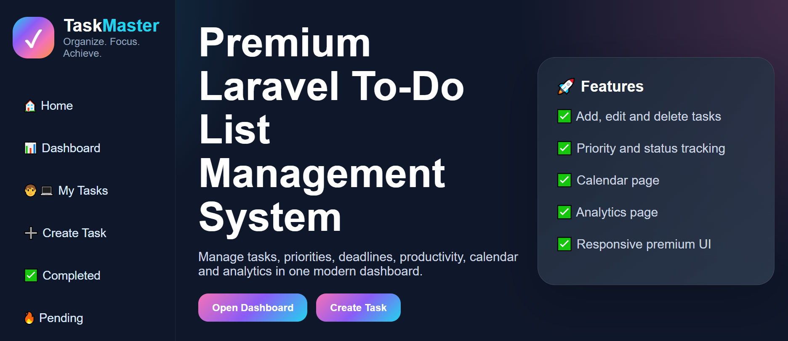

2.


3.
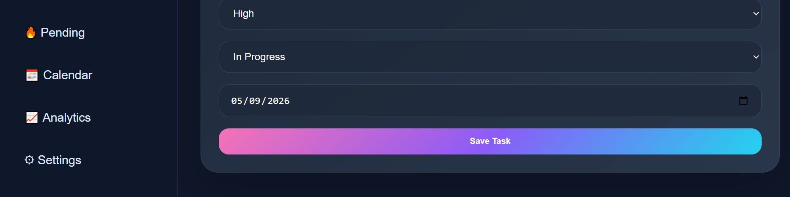

4.
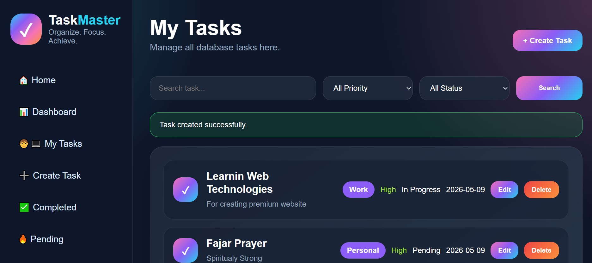

5.
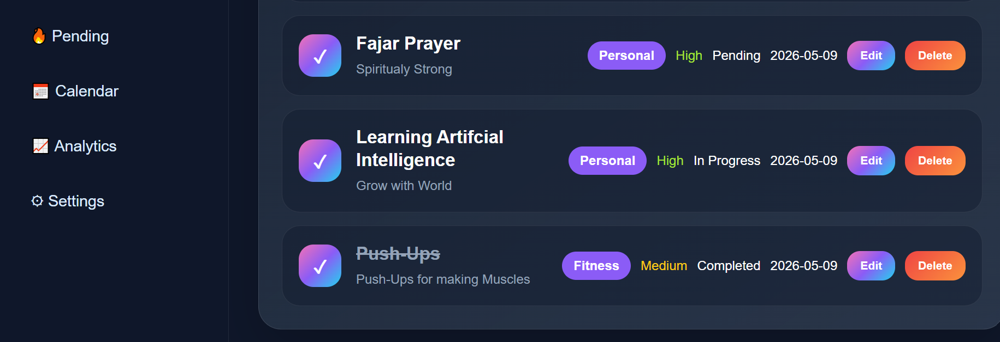

6.
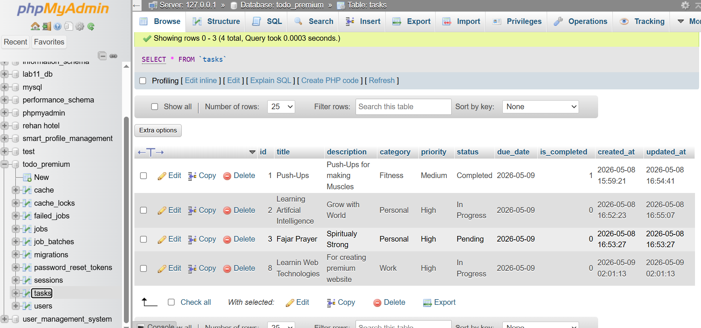

7.
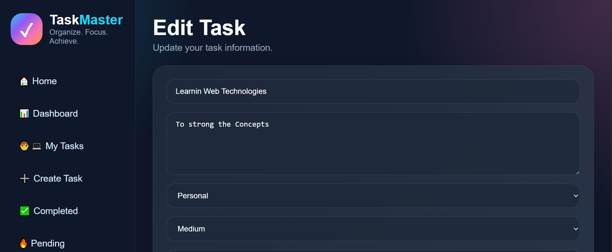

8.
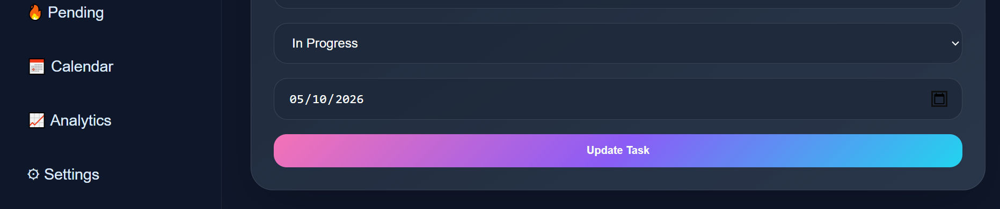

9.
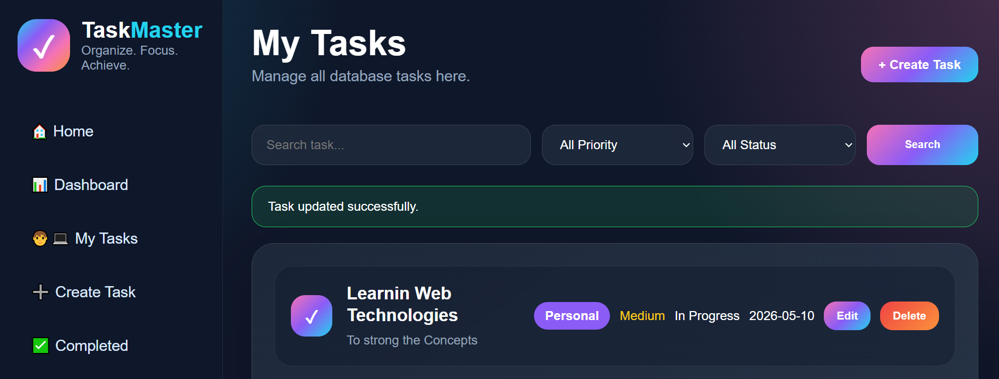

10.


11.
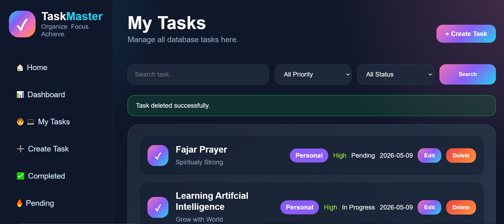

12.
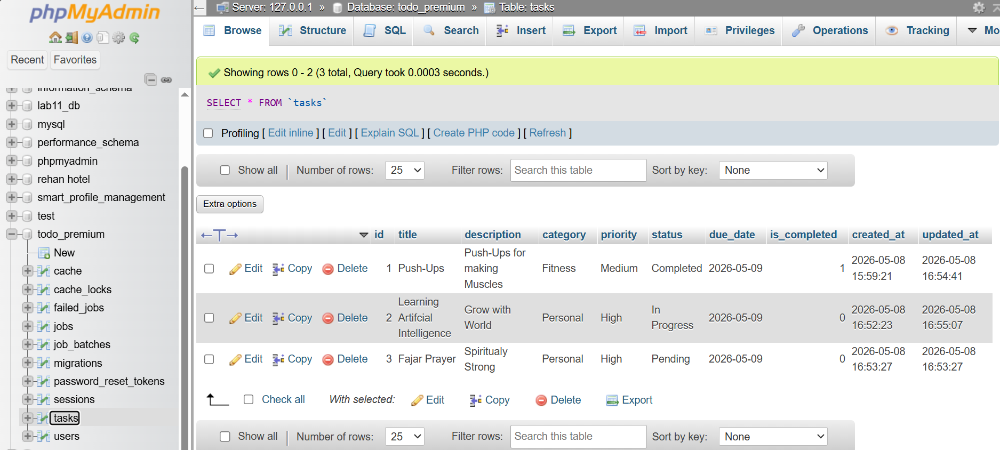

13.
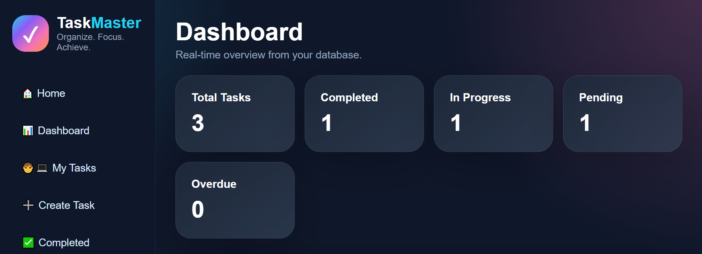

14.
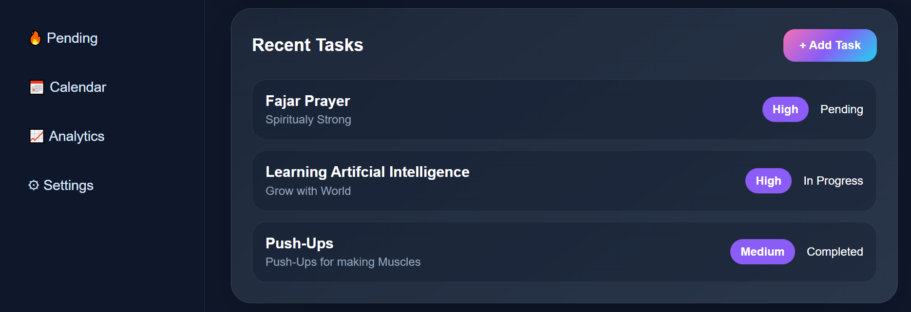

15.
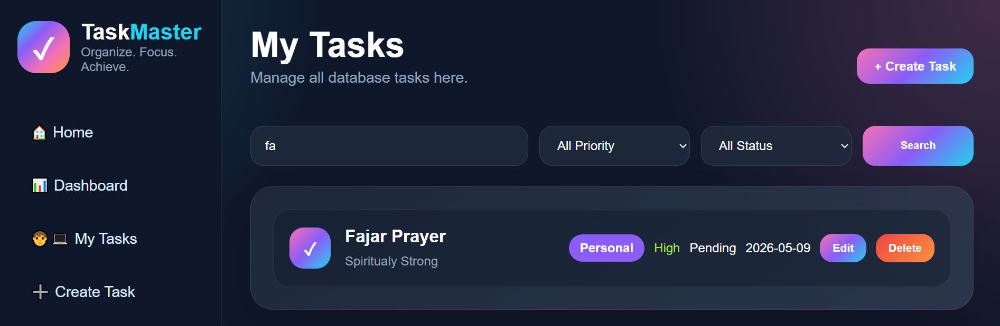

16.
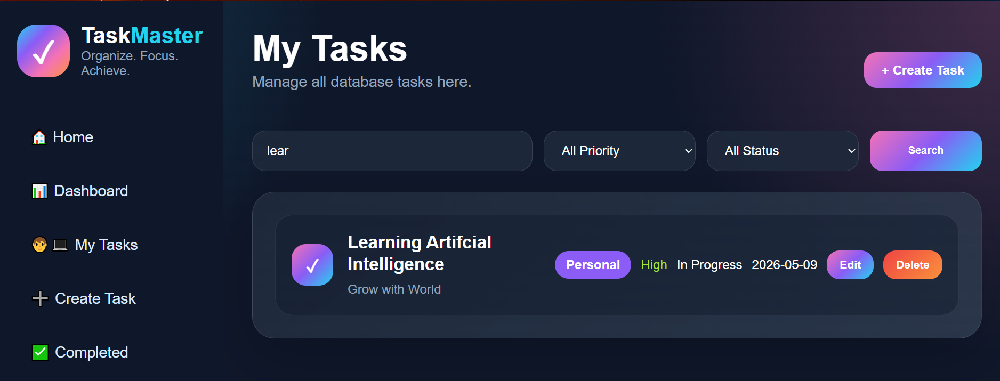

17.
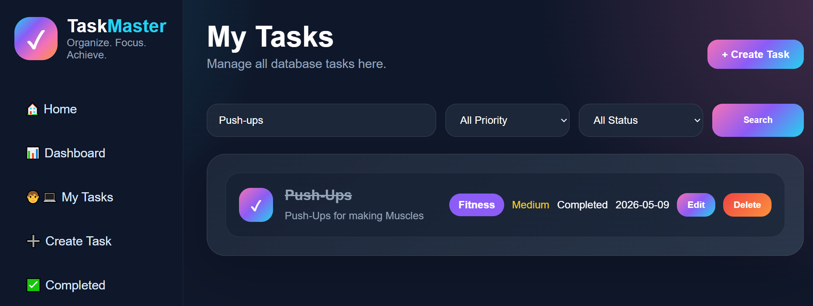

18.
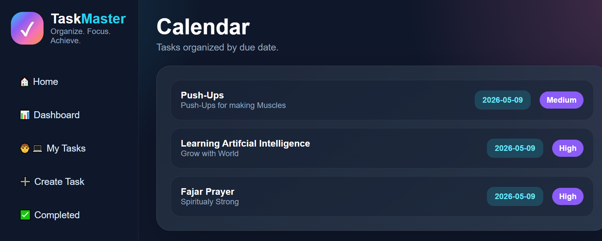

19.
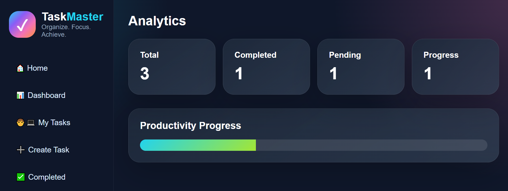

20.
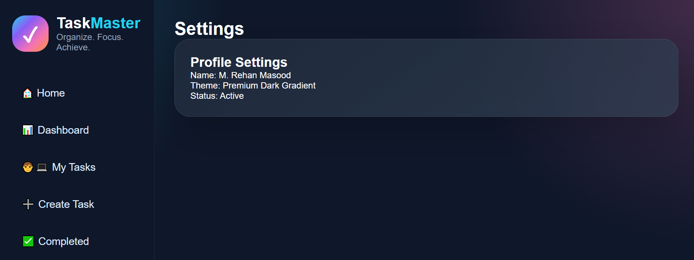

# 📸 Features

## ✅ Task Management
- Create tasks
- Edit tasks
- Delete tasks
- Mark tasks completed
- Task filtering
- Search tasks
- Priority management

## 📊 Dashboard
- Total tasks
- Completed tasks
- Pending tasks
- Overdue tasks
- In-progress tasks

## 📅 Calendar
- Task due dates
- Organized schedule view

## 📈 Analytics
- Productivity progress
- Statistics overview

## 🎨 UI/UX
- Responsive design
- Premium gradient colors
- Modern sidebar navigation
- Glassmorphism effects
- Smooth interface

---

# 🛠 Tech Stack

- Laravel 12
- PHP 8+
- MySQL
- Blade Template Engine
- CSS3
- XAMPP

---

# 📂 Project Structure

```bash
app/
resources/
routes/
public/
database/
